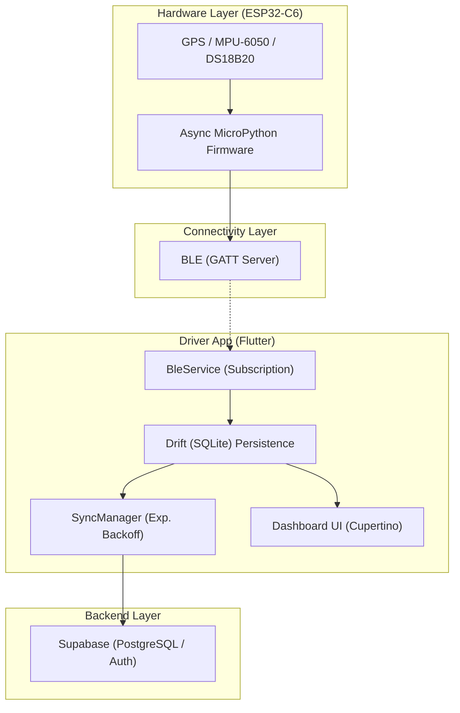

# Last Mile Tracker

[](https://github.com/maninder/last_mile_tracker/actions/workflows/flutter_ci.yml)
[](https://github.com/maninder/last_mile_tracker/actions/workflows/firmware_lint.yml)
[](https://github.com/maninder/last_mile_tracker/actions/workflows/codeql.yml)
[](https://opensource.org/licenses/MIT)

**Enterprise-Grade Offline-First Logistics Tracking Solution**

A high-performance monorepo for real-time telemetry, featuring an asynchronous MicroPython firmware for ESP32-C6 and a premium Flutter driver app with local SQLite persistence and secure data synchronization.

---

## 🏗️ System Architecture



---

## 📂 Repository Structure

| Path | Description | Technology |
| :--- | :--- | :--- |
| [`firmware_esp32/`](firmware_esp32/) | MicroPython firmware for telemetry edge devices. | Python / uasyncio |
| [`apps/driver/`](apps/driver/) | Enterprise-grade mobile tracking application. | Flutter / Riverpod / Drift |
| [`backend/`](backend/) | Placeholder for data orchestration and analytics. | Supabase / Typescript |

---

## ✨ Key Features

- **Asynchronous Edge Computing**: Firmware uses `uasyncio` for non-blocking 10Hz sensor sampling and I/O.
- **Offline-First Persistence**: Driver app stores all telemetry locally in indexed SQLite, ensuring data integrity during outages.
- **Enterprise Security**: Secure storage for credentials via Keychain (iOS) and EncryptedSharedPreferences (Android).
- **Privacy First**: Built-in coordinate masking in local logs and secure transmission protocols.
- **Premium UX**: Smooth animations, glassmorphism UI, and real-time map tracking.

---

## 🚀 Getting Started

### 1. Hardware Firmware (ESP32-C6)

1. Flash **MicroPython** to your ESP32-C6.
2. Clone this repo and navigate to `firmware_esp32/`.
3. Upload all files:

   ```bash
   mpremote cp -r . :
   ```

4. Wiring details are in the [firmware docs](firmware_esp32/README.md).

### 2. Driver App Setup

1. Navigate to `apps/driver/`.
2. Install dependencies:

   ```bash
   flutter pub get
   ```

3. Run the application:

   ```bash
   flutter run
   ```

---

## 🛠️ Development & Standards

- **Conventional Commits**: Please follow the [Conventional Commits](https://www.conventionalcommits.org/) format.
- **CI/CD**: Every PR is automatically scanned for security (CodeQL) and analyzed for code quality.
- **Contributing**: Read our [CONTRIBUTING.md](CONTRIBUTING.md) for detailed workflow instructions.

---

## 🗺️ Roadmap

- [ ] Implement SSL Pinning for backend communication.
- [ ] Add Marker Clustering for the Live Map.
- [ ] Implement OTA firmware updates via BLE.
- [ ] Add comprehensive E2E tests for the sync layer.

## 📄 License

Distributed under the **MIT License**. See `LICENSE` for more information.
