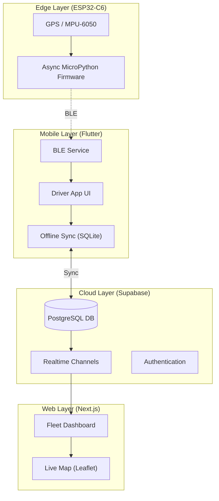

# Last Mile Tracker 🚛

[](https://github.com/maninder/last_mile_tracker/actions/workflows/mobile_ci.yml)
[](https://github.com/maninder/last_mile_tracker/actions/workflows/firmware_esp32.yml)
[](https://github.com/maninder/last_mile_tracker/actions/workflows/codeql.yml)
[](https://opensource.org/licenses/MIT)
[](https://flutter.dev)
[](https://nextjs.org)
[](https://supabase.com)

> **Enterprise-Grade Offline-First Logistics Solution**
>
> A high-performance monorepo for real-time fleet telemetry, edge computing, and logistics management. Features an async MicroPython firmware, a resilient Flutter driver app, and a real-time Next.js command dashboard.

---

## 🏗️ System Architecture



---

## 📂 Monorepo Structure

| Project | Path | Tech Stack | Description |
| :--- | :--- | :--- | :--- |
| **Mobile App** | [`apps/mobile/`](apps/mobile/) | Flutter, Riverpod, Drift | Mobile app for drivers with offline persistence & BLE connectivity. |
| **Fleet Dashboard** | [`apps/fleet_dashboard/`](apps/fleet_dashboard/) | Next.js, Supabase, Tailwind | Real-time web dashboard for fleet monitoring and dispatch. |
| **Firmware** | [`firmware_esp32/`](firmware_esp32/) | MicroPython, ESP32 | Async firmware for high-frequency sensor telemetry. |
| **Shared Models** | [`packages/lmt_models/`](packages/lmt_models/) | Dart | Shared data models and types for the ecosystem. |

---

## ✨ Key Features

### 📱 Driver App

- **Offline-First**: Robust SQLite sync engine ensures data integrity even without internet.
- **BLE Integration**: Direct communication with custom ESP32 hardware.
- **Premium UX**: Glassmorphism design system using Cupertino widgets.
- **Background Tracking**: Reliable location services optimized for battery life.

### 🖥️ Fleet Dashboard

- **Live Intelligence**: Real-time updates of vehicle positions and sensor data via Supabase.
- **Modern UI**: Dark-mode first design with Tailwind CSS and interactive maps.
- **Fleet Management**: Comprehensive view of active drivers, routes, and alerts.

### 📟 Firmware (ESP32)

- **High Frequency**: 10Hz sensor sampling using `uasyncio`.
- **Edge Caching**: Local buffering prevents data loss during disconnects.
- **Low Power**: Optimized deep sleep and connection intervals.

---

## 🚀 Getting Started

### Prerequisites

- **Flutter SDK**: `3.x`
- **Node.js**: `18+`
- **Python**: `3.10+` (for firmware tools)
- **Supabase**: Account & CLI

### 1. Driver App (Mobile)

```bash
cd apps/driver
flutter pub get
flutter run
```

### 2. Fleet Dashboard (Web)

```bash
cd apps/fleet_dashboard
npm install
npm run dev
```

### 3. Firmware (Hardware)

```bash
cd firmware_esp32
# Flash MicroPython and upload code
mpremote cp -r . :
```

---

## 🛠️ Development & Standards

- **Conventional Commits**: We follow [Conventional Commits](https://www.conventionalcommits.org/).
- **Linting**: Strict rules for Dart (Flutter Lints) and TypeScript (ESLint).
- **CI/CD**: Automated workflows via GitHub Actions for testing and releases.

For detailed contribution guidelines, please read [CONTRIBUTING.md](CONTRIBUTING.md).

---

## 📄 License

Distributed under the **MIT License**. See [`LICENSE`](LICENSE) for more information.
